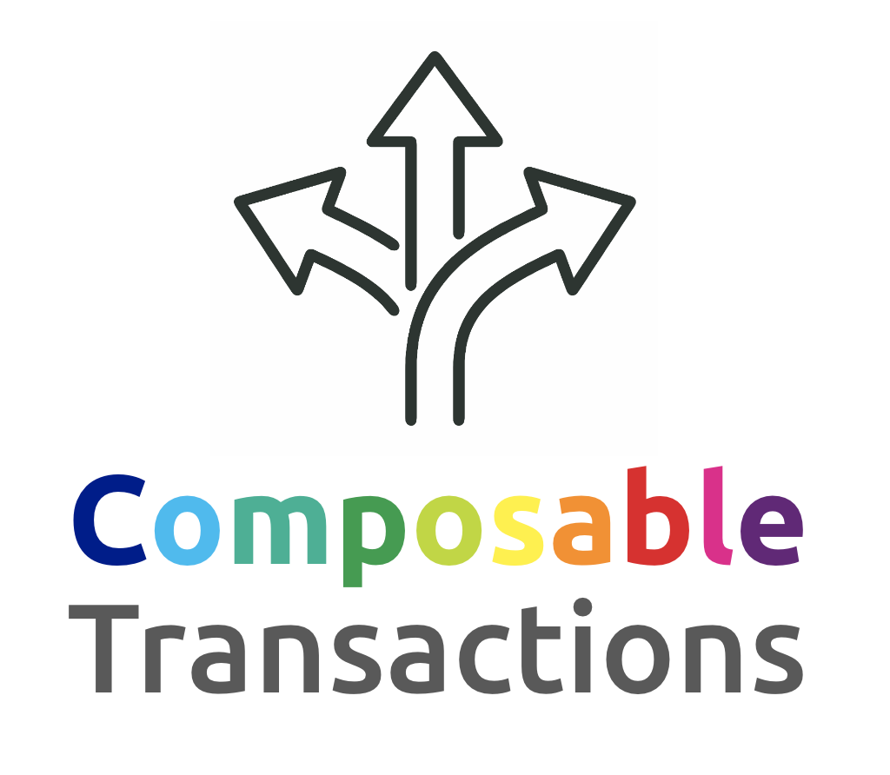

<p align="center"></p>

Normal transactions can make only a single call to a smart contract.

This means that when we need to call a function many times, or interact with different smart contracts, we need a separate transaction for each smart contract interaction.

Composable Transactions bring the ability to **make many calls in a single transaction**, either to the same or to different smart contracts.

Even more than calls, this feature allows **a variety of commands** to be executed, including storing the result of a call into a (temporary) variable, conversion of the value, math operations, and assertion (reverts the whole transaction if evaluates to `false`)


## Characteristics

1. Multiple calls
2. Atomicity
3. Sequential execution
4. Act on current state
5. Scripting
6. No blind signing


### Atomicity

If any of the calls fail, the entire transaction is aborted.

This means that either all calls succeed or none of them.


### Sequential Execution

Execute a series of contract calls with the guarantee that they happen sequentially with no external action occurring between them.


### Act on current state

Do actions using the current values from contracts and account states
by making queries to contracts and using the returned value on the same transaction.

This is useful when another transaction arrives first and changes the contract state.


### Scripting

Instead of just a list of calls, it is possible to process the returned values and act according to them.

The language supports data conversion and manipulation, assertion, conditional execution, and more.


### No Blind Signing

The transaction can be reviewed even on hardware wallets before approval or rejection

The user can check each command and its arguments

The scripts contain the function signature (human readable). The function selector is computed at execution time


## Use Cases

**1)** Purchase airplane tickets and hotel reservation from different contracts, only if both succeed. If some of the purchases fail, the other is reverted (the user does not want one of them if the other is not acquired)

**2)** Swap token and buy something with it. If the purchase fails, the user does not want that intermediary token

**3)** Transferring token (fungible and/or non-fungible) to multiple recipients at the same time

**4)** Transferring different tokens (fungible and/or non-fungible) to one recipient in a single transaction

**5)** Mint many non-fungible tokens (NFTs) in a single transaction

**6)** Trustless swap (or purchase): check if the purchased token was received, otherwise revert the transaction

**7)** Swap tokens using a split route. Check the minimum output in the transaction itself and revert if not satisfied

**8)** Swap to an exact amount of the output token when using a multi-hop route, by querying a contract for the right amount to send in the same transaction

**9)** Approve contract B to use contract A (token) and then call a function on contract B that handles the resources on contract A (eg: approve and swap, approve and add liquidity) on a single transaction

**10)** Approve, use resource, and remove approval on a single transaction, with the guarantee that no other operation would happen in between while the resource/token is approved to contract B

**It also allows** (by creating compatible smart contracts):

**11)** Swap tokens __without approval__

**12)** Add liquidity to a pool (2 tokens) in a single transaction __without approval__

**13)** Multisig wallet users and DAO users can create and vote on an entire script of commands


## Implementation

### Client Side

As most clients use web-browsers, the scripts are built in JSON format, like this one:

```javascript
[
  ["call","<token 1>","transfer(address,uint256)","<recipient 1>","<amount 1>"],
  ["call","<token 2>","transfer(address,uint256)","<recipient 2>","<amount 2>"],
  ["call","<token 3>","transfer(address,uint256)","<recipient 3>","<amount 3>"]
]
```

As this format is not efficiently processed by EVM code, it is then converted to binary
format using a small library on the browser (or another environment)

The converted script in binary format is then included in the transaction as the payload

The transaction is marked with a special "type" to differentiate from normal transactions.
The first implementation uses this method:

* recipient address := signer address
* amount := 0
* payload := script

But it can have some other method, like a explicit type (MULTICALL or SCRIPT ...)

### Execution Side

The execution client can identify these transactions and process them accordingly

The current implementation uses a smart contract to parse and execute the binary script / commands

There is no reference to this contract on the transaction

The execution client calls a function on this contract passing the binary script as argument.
The call is made using the CALLCODE opcode (0xF2) executed as the caller account.

The binary format is engineered to minimize gas usage when processed


### Usage by Contracts

As the script executor is a smart contract, other contracts can also interface with it
using the DELEGATECALL opcode (0xF4) and passing the script as argument.

One use would be by MultiSig wallets and DAOs, in which scripts can be stored, reviewed,
voted, and only executed when/if approved.


## Scripts

The scripts are built in JSON format as a list of operations to be executed.

The first element of each operation is the command name, as a string.

Example:

```javascript
[
  ["call","0x6b175474e89094c44da98b954eedeac495271d0f","transferAndCall","0x...","12500000"],
  ["balance"],
  ["assert","%last_result%",">=","25000000000000000"]
]
```


### Variables

Another feature is the use of variables, in the format `%name%`

When a string in the above format is found, it is replaced by the corresponding value.

One hard-coded variable is the returned value from the last operation: `%last_result%`


Here is an example using the returned value from the first call on the second one:

```javascript
[
  ["call","<address 1>","<function 1>","arg1","arg2"],
  ["call","<address 2>","<function 2>","%last_result%"]
]
```

The `%last_result%` variable has its value replaced when a new operation that returns a value is executed.

If we need to keep the previous value, we can use the `store` command. It is used to rename the `%last_result%` variable to something else.

This example calls a third function using the return values from the first and the second calls:

```javascript
[
  ["call","<address 1>","<function 1>","arg1","arg2"],
  ["store","result1"],
  ["call","<address 2>","<function 2>","arg1","arg2"],
  ["call","<address 3>","<function 3>","%result1%","%last_result%"]
]
```


### Assertion

One of the most important features of Composable Transactions is the `assert` command

If the assertion fails, the whole transaction is reverted

The command expects an expression in one of these formats:

* value1, operator, value2
* value1, operator, value2, {and|or}, value3, operator, value4
* value1, operator, value2, {and|or}, value3, operator, value4, {and|or} ...

Where the operator can be: `=` `!=` `>` `>=` `<` `<=`

And the logic operators: `and` `or`

On this example the transaction will revert if the value returned on the second call is lower than the value returned on the first call:

```javascript
[
  ["call","<address 1>","<function 1>","arg1","arg2"],
  ["store","result1"],
  ["call","<address 2>","<function 1>","arg1","arg2"],
  ["assert","%last_result%",">=","%result1%"]
]
```


### Tuples

Some functions return tuples or structures

It is possible to extract values from these tuples using the `get` command

The retrieved value is stored on another variable

The command has this format:

```
"get" <source_variable> <position_on_tuple> <data_type> <destination_variable_name>
```

The position uses base 1

The supported data types are:

* uint256
* int256
* bool
* address
* string
* bytes

This example extracts 2 values from the returned tuple `(bool,uint256)`:

```javascript
[
  ["call","<address 1>","<function 1>","arg1","arg2"],
  ["get","%last_result%",1,"bool","success"],
  ["get","%last_result%",2,"uint256","amount"],
  ["assert","%success%","=",true,"and","%amount%",">=","25000000000000000"]
]
```


---


### Commands

To support a variety of use cases, composable transactions contain many different commands:

* Smart contract call
* Sending native tokens
* Checking account balance
* Mathematical operations
* Variables
* Conversions
* Assertion
* Conditional stop
* Returning a value


## List of Commands

(click on a command to expand)


### contract call

<details>
<summary>call</summary><blockquote>

```javascript
["call",address,function_sig,args...]
```

Calls a function on a smart contract

Examples:

```javascript
["call","%contract%","transfer(address,uint256)","%to%","%amount%"]
["call","0x6b175474e89094c44da98b954eedeac495271d0f","transfer(address,uint256)","0xb015a47f8e5511076c9d0372bf190ac872d0f257",12500000000000000000n]
```

If the call fails, the entire transaction is reverted
</blockquote></details>

<details>
<summary>call-send</summary><blockquote>

```javascript
["call-send",amount,address,function_sig,args...]
```

Calls a function on a smart contract, also sending an amount of native tokens

Examples:

```javascript
["call","1.5 ETH","%contract%","do_something()","%arg%"]
```

If the call fails, the entire transaction is reverted
</blockquote></details>

<details>
<summary>pcall</summary><blockquote>

```javascript
["pcall",address,function_sig,args...]
```

Makes a protected call to a function on a smart contract.

A "protected call" means that if the call fails, it continues execution on the next command.

It returns a list with 2 elements: `[success, result]`

We can check if the call succeeded by checking the first returned value

Examples:

```javascript
["pcall","%contract%","transfer","%to%","10.5"]
["store","result"]
["get","%result%",1]
["stop if","%last_result%","=",true]
["get","%result%",2]
...
```
</blockquote></details>

<details>
<summary>pcall-send</summary><blockquote>

```javascript
["pcall-send",amount,address,function_sig,args...]
```

Makes a protected call to a function on a smart contract,
also sending an amount of native tokens.

A "protected call" means that if the call fails, it continues execution on the next command.

It returns a list with 2 elements: `[success, result]`

We can check if the call succeeded by checking the first returned value

Examples:

```javascript
["pcall-send","1.5 eth","%contract%","do_something","%arg%"]
["store","result"]
["get","%result%",1]
["stop if","%last_result%","=",false]
["get","%result%",2]
...
```
</blockquote></details>


### balance and transfer

<details>
<summary>balance</summary><blockquote>

```javascript
["balance"]
["balance",address]
```

Returns the current balance in native tokens from the given account address.

If no address is given, it returns the balance of the caller account.
</blockquote></details>

<details>
<summary>send</summary><blockquote>

```javascript
["send",address,amount]
```

Transfer an amount of native tokens to the informed address
</blockquote></details>


### variables

<details>
<summary>let</summary><blockquote>

```javascript
["let",variable_name,value]
["let",variable_name,value,token_address]
```

Assign the value to the variable

The value can be an integer (uint256 or int256), address, string, boolean or tuple

Here are some examples:

```javascript
["let","text","hello world!"]
["let","DAI","0x6b175474e89094c44da98b954eedeac495271d0f"]
["let","min_amount",12500000000000000000n]
["let","data",["bigdeal.eth",2500000000000000000n,true]]
```

It is also possible to convert an amount in decimal format to its integer counterpart,
by supplying the address of the token as the third argument

**:warning:** The decimal format must **always** contain a `.`

```javascript
["let","min_amount","0.05","%token2%"]
["let","min_amount","1.5","%DAI%"]
["let","min_amount","100.","0x6b175474e89094c44da98b954eedeac495271d0f"]
```
</blockquote></details>

<details>
<summary>store</summary><blockquote>

```javascript
["store",variable_name]
```

Store the last result in a variable with the given name

Example:

```javascript
["store","amount"]
```
</blockquote></details>


### tuples

<details>
<summary>get</summary><blockquote>

```javascript
["get","<source_variable>",<position_on_tuple>,"<data_type>","<destination_variable_name>"]
```

Retrieve an element from a tuple or structure and store it on another variable

The position uses base 1

The supported data types are:

* uint256
* int256
* bool
* address
* string
* bytes

This example extracts 2 values from the returned tuple `(bool,uint256)`:

```javascript
[
  ["call","<address 1>","<function 1>","arg1","arg2"],
  ["get","%last_result%",1,"bool","success"],
  ["get","%last_result%",2,"uint256","amount"],
  ["assert","%success%","=",true,"and","%amount%",">=",25000000000000000n]
]
```
</blockquote></details>


### math

<details>
<summary>add</summary><blockquote>

```javascript
["add",value1,value2]
```

Adds 2 values and return the result

The values must be of the same type

They can be uint256 or int256
</blockquote></details>

<details>
<summary>sub</summary><blockquote>

```javascript
["sub",value1,value2]
```

Subtract one value from the other and return the result

The values must be of the same type

They can be uint256 or int256
</blockquote></details>

<details>
<summary>mul</summary><blockquote>

```javascript
["mul",value1,value2]
```

Multiplies 2 values and return the result

The values must be of the same type

They can be uint256 or int256
</blockquote></details>

<details>
<summary>div</summary><blockquote>

```javascript
["div",value1,value2]
```

Divides the first value by the second and returns the result

The values must be of the same type

They can be uint256 or int256
</blockquote></details>

<details>
<summary>mod</summary><blockquote>

```javascript
["mod",value1,value2]
```

Returns the modulo of the division of the first value by the second

The values must be of the same type

They can be uint256 or int256
</blockquote></details>

<details>
<summary>pow</summary><blockquote>

```javascript
["pow",base,exponent]
```

Elevates the base to the power of the exponent and returns the result

The base can be uint256 or int256

The exponent must be uint256
</blockquote></details>


### conversions

<details>
<summary>touint</summary><blockquote>

```javascript
["touint",value]
```
</blockquote></details>

<details>
<summary>toint</summary><blockquote>

```javascript
["toint",value]
```
</blockquote></details>

<details>
<summary>tostring</summary><blockquote>

```javascript
["tostring",value]
```
</blockquote></details>


### assertion

<details>
<summary>assert</summary><blockquote>

```javascript
["assert",<expression>]
```

If the assertion fails, the whole transaction is reverted and marked as failed

Examples:

```javascript
["assert","%variable_name%",">",10]
["assert","%var1%","<=","%var2%"]
["assert","%var1%","<","%var2%","and","%var1%",">=",150000000000000000n]
["assert","%var1%","=","text1","or","%var1%","=","text2","or","%var1%","=","text3"]
```

The operator can be: `=` `!=` `>` `>=` `<` `<=` `match`

The logic operators: `and` `or`
</blockquote></details>


### conditional stop

<details>
<summary>stop if</summary><blockquote>

```javascript
["stop if",<expression>]
```

Stop execution of the script if the expression evaluates to `true`

In this case the remaining commands will not be executed

Continues execution of the script if the expression evaluates to `false`

Example expressions:

```javascript
["stop if","%variable_name%",">",10]
["stop if","%var1%","<=","%var2%"]
["stop if","%var1%","<","%var2%","and","%var1%",">=",1500]
["stop if","%var1%","=","text1","or","%var1%","=","text2","or","%var1%","=","text3"]
```

The operators can be: `=` `!=` `>` `>=` `<` `<=` `match`

The logic operators: `and` `or`
</blockquote></details>


### return result

<details>
<summary>return</summary><blockquote>

```javascript
["return"]
["return",value]
```

Example:

```javascript
["return","%last_result%"]
```
</blockquote></details>


## Example Scripts for Specific Use Cases

Buy 2 products or services on a single transaction: (using pre-approved contracts)

```
[
  ["call","<shop 1>","buy(uint256,uint256)","<product_id 1>","<quantity 1>"],
  ["call","<shop 2>","buy(uint256,uint256)","<product_id 2>","<quantity 2>"],
]
```

Buy 2 products or services on a single transaction: (using transferAndCall)

```
[
  ["call","<token 1>","transferAndCall(address,uint256,bytes)","<shop 1>","<amount 1>",buffer1],
  ["call","<token 2>","transferAndCall(address,uint256,bytes)","<shop 2>","<amount 2>",buffer2],
]
```

Buy 2 products or services on a single transaction: (using tranfer)

```
[
  ["call","<token 1>","transfer(address,uint256)","<shop 1>","<amount 1>"],
  ["call","<shop 1>","buy(uint256,uint256)","<product_id 1>","<quantity 1>"],
  ["call","<token 2>","transfer(address,uint256)","<shop 2>","<amount 2>"],
  ["call","<shop 2>","buy(uint256,uint256)","<product_id 2>","<quantity 2>"],
]
```

Acquire token B via swap and buy a product/service with it:

```
[
  ["call","<swap_pair>","swap(...)",...],
  ["call","<shop>","buy(uint256,uint256)","<product_id>","<quantity>"],
]
```

### Trustless Swap

These are swaps in which the user does not need to trust the swap contract

If the contract does not transfer the desired tokens, the transaction is reverted

It can allow for direct token swaps between users A and B, in a complete trustless way

The "swap contract" can also be a contract wallet (peer-to-peer), a limit order swap contract, etc.

Here is a trustless swap of **fungible tokens**:

```
["call","<tokenB>","balanceOf(address)","%me%"],         <-- get the previous balance of token B
["store","balance_before"],                              <-- store it in a variable
["call","<tokenA>","transfer(address,uint256)","<to>","<amount>"], <-- swap token A for token B
["call","<tokenB>","balanceOf(address)","%me%"],         <-- get the new balance of token B
["sub","%last_result%","%balance_before%"],              <-- subtract one balance by the other
["assert","%last_result%",">=","<minimum_amount>"]       <-- assert that we got the minimum amount
```

Here is a trustless swap sending fungible tokens for a **non-fungible token** (buy NFT):

```
["call","<marketplace>","buy(uint256)","<token_id>"],    <-- request the swap, pre-approved
["call","<nft>","ownerOf(uint256)","<token_id>"],        <-- get the owner of the non-fungible token
["assert","%last_result%","=","%me%"]                    <-- assert that it was transferred
```


## Human-readable display of amounts

Amounts in native format, like `25000000000000000`, are difficult do understand.
The user needs to know the number of decimals that the token contract uses.

There is an alternative way to display these amounts:

We can use the `let` command to convert an amount in **decimal format** to its corresponding integer format

The `let` command when used with an additional argument (a token contract address)
is able to retrieve the number of decimals from the ERC20 contract by calling its `decimals()` function
and then it converts the supplied amount in decimal format to an integer

Example:

```javascript
["let","amount","12.5","0x6b175474e89094c44da98b954eedeac495271d0f"]
```

The command above will store the value `12500000000000000000` on the variable with name `amount`

So instead of using a call with the supplied amount like this:

```javascript
["call","<token>","transfer(address,uint256)","<recipient>","2500000000000000000"],
```

We use the amount in decimal format in the `let` command and use the variable in the call:

```javascript
["let","amount","2.5","0x6b175474e89094c44da98b954eedeac495271d0f"]
["call","0x6b175474e89094c44da98b954eedeac495271d0f","transfer(address,uint256)","<recipient>","%amount%"],
```

Optionally, we can also use another variable to store the contract address as it is used twice:

```javascript
["let","DAI","0x6b175474e89094c44da98b954eedeac495271d0f"]
["let","amount","2.5","%DAI%"]
["call","%DAI%","transfer(address,uint256)","<recipient>","%amount%"],
```


## Display on hardware wallets

Hardware wallets have no connection to the internet

Currently calls to contracts in normal transactions are displayed on these devices as "blind signing"


It is dangerous to sign a transaction without seeing its contents! Many people lost funds doing it.

Composable Transactions 
can be reviewed on these devices (as well as on other off-line and on-line wallets)
so the user can reject them if the content in unexpected.

No more blind signing!

By default, each operation from a script is displayed on the device in sequential order, with its parameters.

And each call is displayed with the function signature and arguments, making clear what is being called on the contract.


## Templates

Even though displaying the script is better than blind signing,
it can still be a lengthy process with many screens to review
and most users will not be able to understand the process

For this reason there are templates of scripts
with known and trusted structure
that can be displayed in a short and more meaninful way to users

A template script is separated into fixed parts and parameters
and the wallets can display only these parameters to the user

Example:

A composable transaction containing this script:

```javascript
["let","DAI","0x6b175474e89094c44da98b954eedeac495271d0f"],
["let","GOLD","0x45804880de22913dafe09f4980848ece6ecbaf78"],
["let","pair","0xb015a47f8e5511076c9d0372bf190ac872d0f257"],  // DAI-GOLD pair address
["call","%GOLD%","balanceOf(address)","%me%"],
["store","balance_before"],
["call","%DAI%","transfer(address,uint256)","%pair%","<amount>"],
["call","%pair%","swap","%DAI%"],
["call","%GOLD%","balanceOf(address)","%me%"],
["sub","%last_result%","%balance_before%"],
["assert","%last_result%",">=","<minimum_amount>"]
```

Would be displayed using dozens of screens on a hardware wallet, and on normal wallets it would be displayed as is. Hard to understand by many people.

It turns out that the above script
implements a **trustless swap** of fungible tokens,
and being of common use it
can be turned into a template.
So it could be displayed in a few screens like this:

```
-----------------
  Trustless Swap
  Send 37.5 DAI
-----------------

-----------------
  Trustless Swap
Receive 0.37 GOLD
-----------------
```
